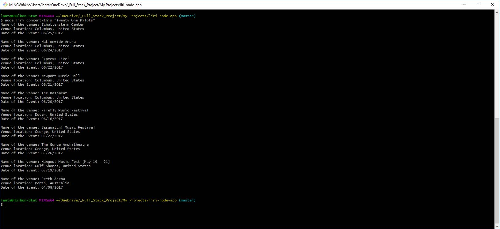
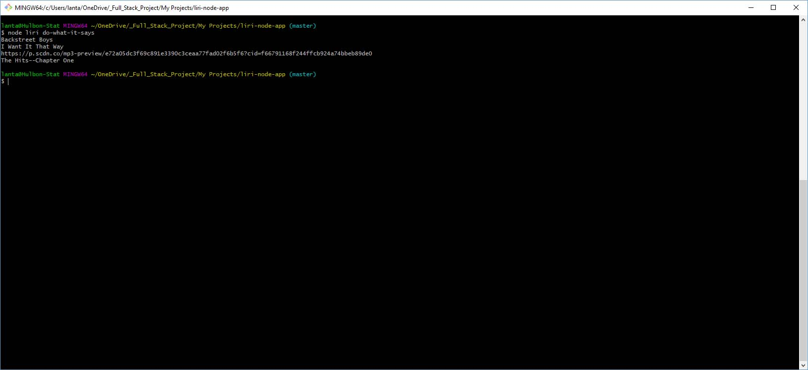
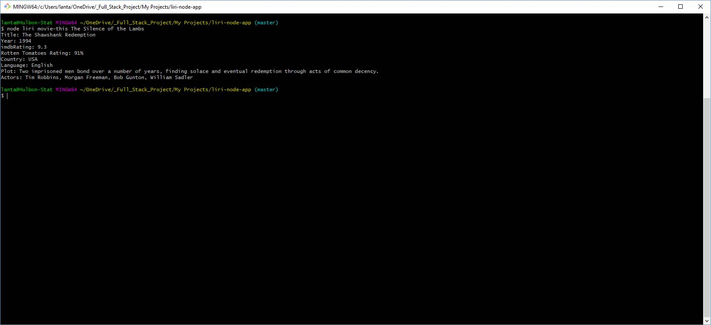
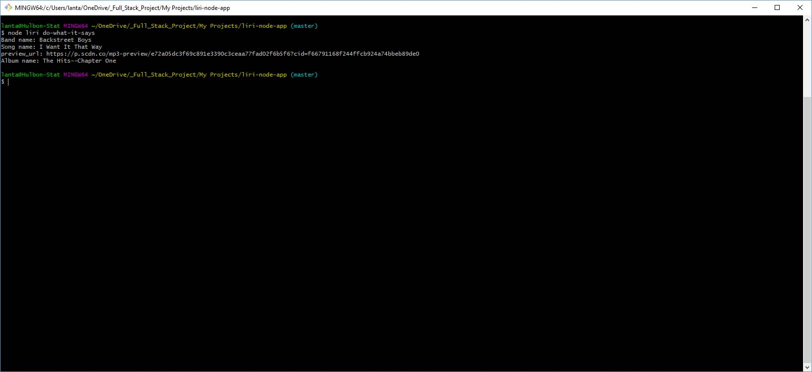
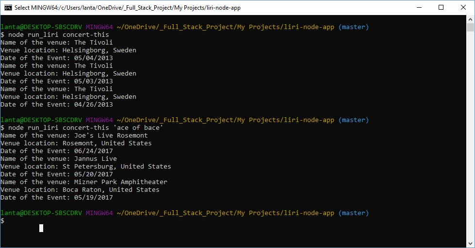
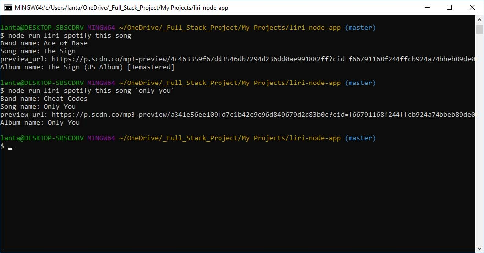
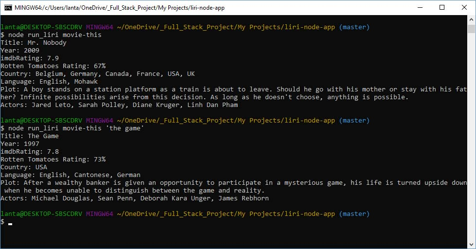
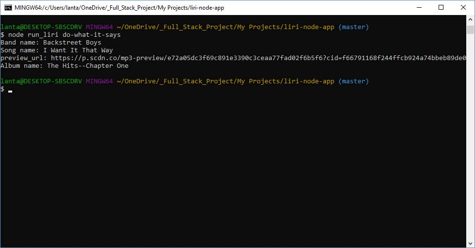

### Overview

LIRI is an app like iPhone's SIRI. However, while SIRI is a Speech Interpretation and Recognition Interface, LIRI is a _Language_ Interpretation and Recognition Interface. LIRI will be a command line node app that takes in parameters and gives you back data.

### Versions

There are Two versions:

1. `liri.js` - whole programm in one js file.

2. `liriClass.js` and `run_liri.js` - <liriClass> is made as class file and runs from the `run_liri.js`.

### Functionality

1. LIRI will search Spotify for songs, Bands in Town for concerts, and OMDB for movies.

2. Link to [GitHub repository](https://github.com/lantanios/LIRI-node-app).

3. Usage:

    run with node.js: `node liri `<argument_1> <argument_2>

    <argument_1> can be:

    1.  `concert-this` 

        * searches for the <argument_2> in Bands in Town Artist Events API and renders the following information about each event to the terminal:

            * Name of the venue
            * Venue location
            * Date of the Event (uses moment to format date as "MM/DD/YYYY")

    2.  `spotify-this-song` 

        * searches for the <argument_2> in Bands in Town Artist Events API and renders the following information about each event to the terminal:

            * Artist(s)
            * The song's name
            * A preview link of the song from Spotify
            * The album that the song is from

        * and If there is no <argument_2>  then program will default to "The Sign" by Ace of Base.

    3.  `movie-this` 

        * searches for the <argument_2> in OMDB API and renders the following information about each event to the terminal:

            * Title of the movie.
            * Year the movie came out.
            * IMDB Rating of the movie.
            * Rotten Tomatoes Rating of the movie.
            * Country where the movie was produced.
            * Language of the movie.
            * Plot of the movie.
            * Actors in the movie.

        * and If there is no <argument_2> then program will default to the movie 'Mr. Nobody.'

    4.  `do-what-it-says` 

        * reads the `random.txt` and uses first string as <argument_1> and second string (separated by `,`) as <argument_2>:

            * returns value depending on <argument_1> and <argument_2>.

         

## Liri uses:

   * [Node-Spotify-API](https://www.npmjs.com/package/node-spotify-api)

   * [Request](https://www.npmjs.com/package/request)

   * [Axios](https://www.npmjs.com/package/axios)

   * [Moment](https://www.npmjs.com/package/moment)

   * [DotEnv](https://www.npmjs.com/package/dotenv)
   
## Screenshots:

# version 1

# version 2

